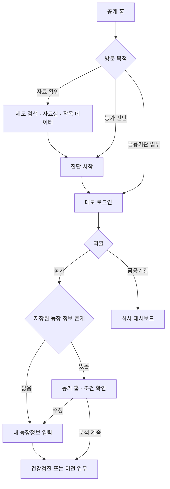
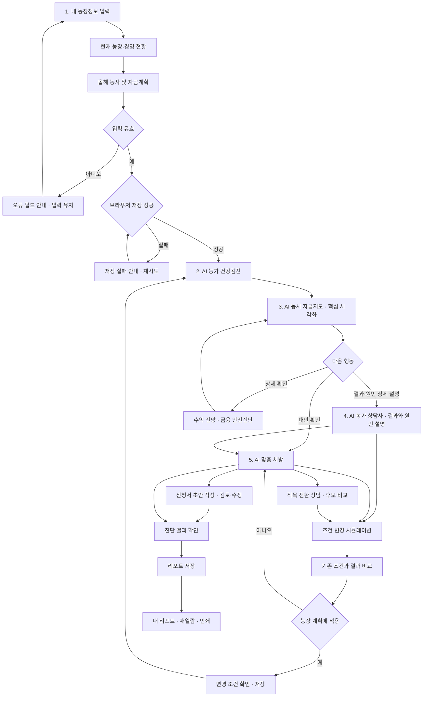
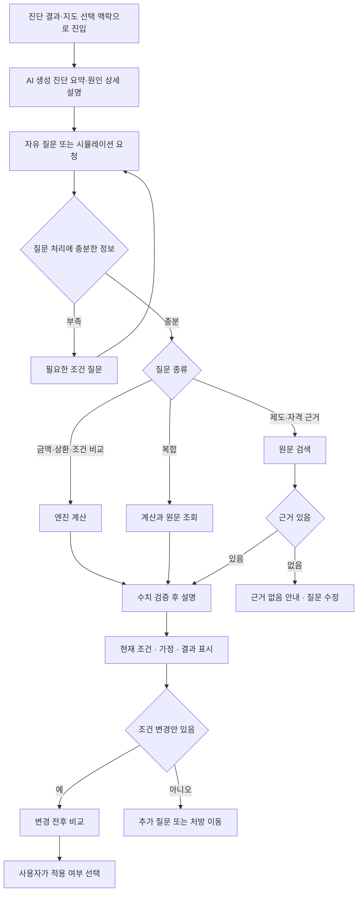
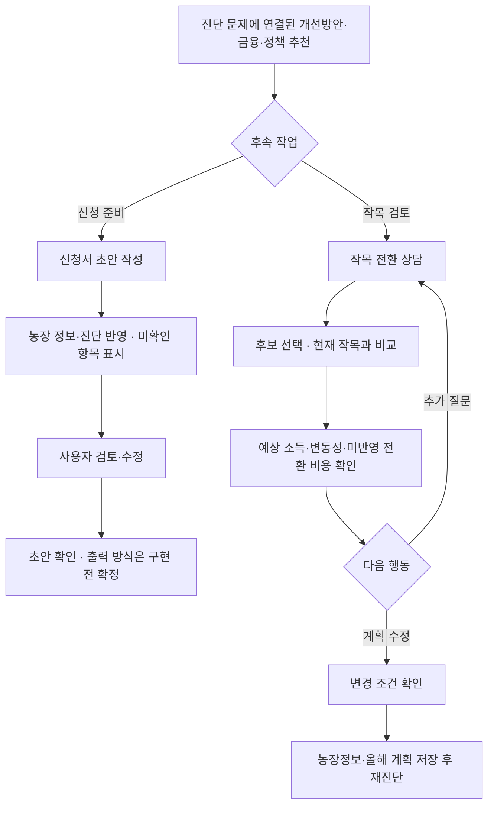
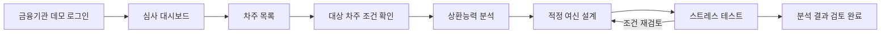

# 청년농 여신 설계 서비스 — 유저 플로우

작성일: 2026-09-05 · 상태: UI 개편 목표 흐름 · 연결 문서: [PRD](PRD.md)

기존 라우트를 바탕으로 한 목표 동작이다. 적용 확인, 결과 갱신 표시, 상세 오류 복구 등은 개편 요구사항이며 현재 구현 여부와 구분한다. UI Kit의 좌측 내비게이션과 카드 구조를 화면 이동 및 정보 우선순위에 적용한다.

## 0. 기준이 되는 5단계

**내 농장정보 입력 → AI 농가 건강검진 → AI 농사 자금지도 → AI 농가 상담사 → AI 맞춤 처방**

1. 농장·경영·자금정보를 간편 입력하고 올해 농사 및 자금계획을 확인한다.
2. 유사 농가 대비 경영·금융 상태를 비교한다. 비교집단이 없으면 작목 통계 평균임을 명시한다.
3. 핵심 기능인 자금지도에서 1년 자금흐름과 미래 위험시점을 시각화한다.
4. AI가 생성한 진단 결과·원인 상세 설명을 확인하고 자유 질문·시뮬레이션을 진행한다.
5. 개선방안·금융·정책 추천을 확인하고 신청서 초안 작성 또는 작목 전환 상담으로 이어간다.

## 1. 전체 진입과 역할

데모 로그인은 실제 본인 인증이나 권한 보안 체계가 아니다. 공개 자료 확인에 로그인을 요구하지 않는다.

## 2. 핵심 농가 여정

5단계는 권장 순서다. 유효한 농장 정보가 있으면 메뉴에서 필요한 단계로 직접 이동할 수 있다. 단계 이동만으로 계산 완료 표시를 하지 않는다.

## 3. 화면별 입출력과 행동

| 단계 | 진입 조건 | 사용자가 하는 일 | 화면 결과 | 주 행동 / 보조 행동 |
|---|---|---|---|---|
| 홈 | 농가 데모 세션 | 현재 조건·다음 할 일 확인 | 농장 요약 또는 빈 상태 | 입력 시작·이어서 보기 / 정보 수정 |
| 내 농장정보 입력 | 최초 또는 수정 | 현재 농장·경영 현황→올해 농사 및 자금계획→확인 | 현재 조건과 올해 계획 | 저장하고 건강검진 / 입력 수정 |
| AI 농가 건강검진 | 유효 프로필 | 유사 농가 비교·경영/금융 진단 확인 | 핵심 상태와 비교집단 근거 | 자금지도 보기 / 조건 수정 |
| AI 농사 자금지도 | 동일 프로필·차입 조건 | 1년 흐름에서 월 선택, 미래 위험 확인 | 시각화와 선택 시점의 상세 | 결과·원인 설명 보기 / 처방·상세 보기 |
| AI 농가 상담사 | 농장 조건·진단·지도 선택 맥락 | AI 상세 설명 확인→자유 질문·시뮬레이션 | 원인 설명·조건별 비교·근거 | 조건 비교 / 맞춤 처방 |
| AI 맞춤 처방 | 조건·분석 결과 | 개선방안·금융·정책 추천 확인 | 문제별 개선안과 근거 | 신청서 초안 작성·작목 전환 상담 / 조건 비교 |
| 결과·리포트 | 유효 진단 결과 | 저장·재열람·인쇄 | 진단 문서와 저장 목록 | 저장·인쇄 / 정보 수정 후 재진단 |

신청서 초안과 저장된 진단 리포트는 서로 다른 결과물이다. 초안 작성만으로 리포트가 저장되거나 기관에 접수되지 않는다.

## 4. 상담과 시나리오 분기

LLM 키가 없으면 규칙·템플릿 경로를 제공한다. 처리 실패는 답변 없음과 구분하고 질문을 유지한다. 시나리오 결과는 적용 확인 전까지 원본 프로필을 변경하지 않는다.

### 맞춤 처방의 두 가지 실행 흐름

금융·정책 후보는 적용 조건과 근거를 함께 제시한다. 초안 작성은 실제 접수와 구분한다. 작목 전환 비용·설비·재배 역량이 계산에 반영되지 않았다면 그 효과를 확정하지 않는다.

## 5. 예외·복귀 경로

| 상황 | 사용자에게 보이는 상태 | 복귀 경로 |
|---|---|---|
| 농장 정보 없이 분석 링크 진입 | 정보 입력 필요 | 입력 완료 후 원래 요청 화면으로 복귀하는 방식 제안 |
| 필수값 누락·범위 오류 | 필드 오류와 단위 | 입력 유지→수정→재검증 |
| 실적 없음 | 통계 추정 표시 | 계속 분석 또는 실적 추가 |
| API 연결 실패 | 계산 실패·재시도 | 입력 유지→같은 조건으로 재요청 |
| 분석 중 조건 변경 | 이전 결과 갱신 필요 | 재계산→최신 조건 결과 표시 |
| 자금 부족 없음 | 해당 시나리오에서 부족 없음 | 가정 확인→스트레스 비교 |
| 권장 차입 0원 | 0원 원인과 생계 부족 여부 | 소득·생활비·규모 검토, 조정 후 재계산 |
| 처방 후보 없음 | 조건에 맞는 후보 없음 | 조건 수정·제도 원문 확인 |
| 저장소 사용 불가 | 저장 실패 | 재시도, 현재 결과 열람·인쇄 유지 |
| 리포트 없음 | 저장된 진단 없음 | 진단 시작 |
| 결과 ID 오류 | 결과를 불러올 수 없음 | 리포트 목록 또는 재진단 |
| 데모 세션 없음 | 로그인 안내 | 로그인 후 허용된 원래 화면 복귀 제안 |

## 6. 재방문과 리포트

재방문 → 같은 브라우저의 프로필 확인 → 조건 유지 시 분석 계속, 수정 시 결과 재계산 → 진단 저장 → 리포트 목록 → 결과 열람·인쇄.

기존 저장은 최대 12건이며 같은 ID를 다시 저장하면 중복을 제거한다. 삭제는 선택한 리포트에 적용하고 농장 정보를 지우지 않는다. UI 개편에서는 삭제 확인을 제공한다. 다른 기기에서 목록이 동기화된다고 표현하지 않는다.

## 7. 금융기관 흐름

이 흐름은 기존 금융기관 라우트의 목표 연결이다. 차주 선택 상태가 모든 화면에 일관되게 전달되는지는 구현 시 점검한다. 농가가 저장한 리포트가 은행 화면으로 자동 전달된다는 가정은 하지 않는다. 대출 승인·실행 버튼은 이번 범위에 포함하지 않는다.

## 8. UI Kit와 화면 배치 연결

| Kit 관찰 요소 | 제품 적용 | 상호작용 |
|---|---|---|
| 좌측 메뉴 | 홈·핵심 5단계·접힌 상세 메뉴 | 현재 위치, 직접 이동, 작은 화면 메뉴 접기 |
| 상단 컨텍스트 | 화면 제목·현재 농장 조건 | 조건 수정, 데모 역할 확인 |
| 요약 카드 | 대표 결과·부족 시점·조건 요약 | 관련 상세로 이동, 미계산·오류 상태 구분 |
| 큰 차트 패널 | 자금지도·조건별 비교 | 월별/장기 구분, 표로 보기 |
| 목록 패널 | 근거 자료·리포트·처방 후보 | 원문 열기, 결과 열람 |

## 9. 리뷰 시나리오

1. 신규 농가가 소득 실적 없이 정보 입력→건강검진→지도를 확인한다.
2. 기존 농가가 실적과 계획 면적을 바꾸면 모든 분석의 조건이 함께 바뀐다.
3. 차입 조건 비교 후 적용하지 않으면 원본 농장 정보가 유지된다.
4. API를 끊어도 입력값이 유지되고 재연결 후 재시도가 가능하다.
5. 권장 차입 0원과 서버 오류가 다른 화면 상태로 표현된다.
6. 리포트 저장 실패 시 성공 알림이 나오지 않는다.
7. 제도 근거가 없으면 확정 답변을 만들지 않는다.
8. 자금지도에서 선택한 월·연차가 상담의 AI 원인 설명에 반영된다.
9. 신청서 초안의 빈 항목을 사용자가 확인·수정할 수 있다.
10. 작목 전환 상담에서 후보 비교 후 계획 변경 또는 원래 조건 유지가 가능하다.
11. 유사 농가 비교집단이 없으면 통계 평균이라는 표시가 나온다.
12. 금융기관 화면에서 농가와 동일 입력 조건의 엔진 결과를 비교한다.
